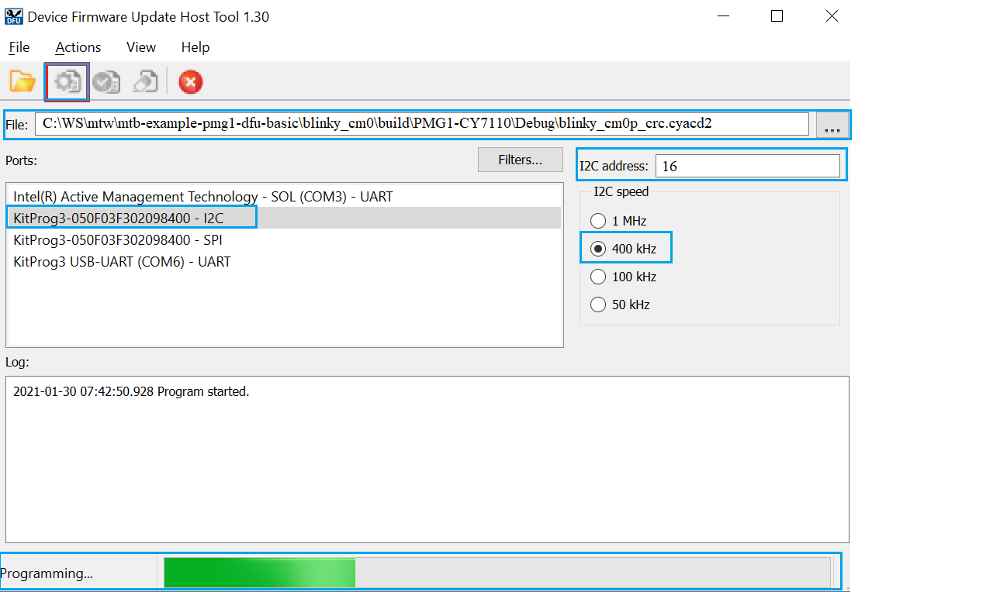
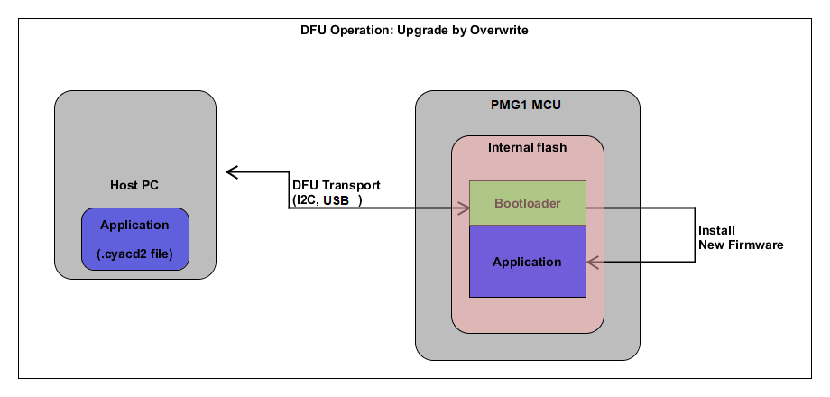
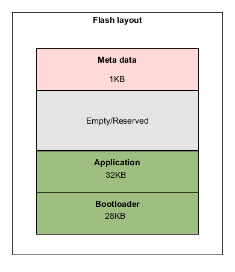

# EZ-PD&trade; PMG1 MCU: Basic Device Firmware Upgrade (DFU)

This example demonstrates basic device firmware update (DFU), also known as "bootloading", with the EZ-PD&trade; PMG1 MCU. This includes downloading an application from a host and installing it in device flash, and then transferring control to that application. This example bundles two applications:

**Bootloader app:** Implements a [DFU middleware library](https://github.com/infineon/dfu)-based basic bootloader application run by the CM0/CM0+ CPU. The bootloader handles image download, verification, and upgrades. When the image is valid, the bootloader lets the CPU boot the application.

**Blinky app:** This is a tiny application run by the CPU that blinks an LED at a 5-Hz rate continuously. This application transfers control to the bootloader when the user button is pressed.

**Note:** This example currently supports only *I2C* and *USB_CDC* for DFU transport.

[View this README on GitHub.](https://github.com/Infineon/mtb-example-pmg1-dfu-basic)

[Provide feedback on this code example.](https://cypress.co1.qualtrics.com/jfe/form/SV_1NTns53sK2yiljn?Q_EED=eyJVbmlxdWUgRG9jIElkIjoiQ0UyMzMxODAiLCJTcGVjIE51bWJlciI6IjAwMi0zMzE4MCIsIkRvYyBUaXRsZSI6IkVaLVBEJnRyYWRlOyBQTUcxIE1DVTogQmFzaWMgRGV2aWNlIEZpcm13YXJlIFVwZ3JhZGUgKERGVSkiLCJyaWQiOiJ2bmFsIiwiRG9jIHZlcnNpb24iOiIxLjAuMCIsIkRvYyBMYW5ndWFnZSI6IkVuZ2xpc2giLCJEb2MgRGl2aXNpb24iOiJNQ0QiLCJEb2MgQlUiOiJXSVJFRCIsIkRvYyBGYW1pbHkiOiJUWVBFLUMgVVNCIn0=)

## Requirements

- [ModusToolbox&trade; software](https://www.cypress.com/products/modustoolbox-software-environment) v2.3 or later (tested with v2.3)
- Set the CY_SUPPORTED_KITS environment variable with the value of "PMG1" to enable support for the PMG1 parts and BSPs under ModusToolbox&trade; software
- Board Support Package (BSP) minimum required version: 1.2.0
- Programming Language: C
- Associated parts: All [EZ-PD&trade; PMG1 MCU](http://www.cypress.com/PMG1) parts

## Supported toolchains (make variable 'TOOLCHAIN')

- GNU Arm® embedded compiler v9.3.1 (`GCC_ARM`) - Default value of `TOOLCHAIN`
- Arm&reg; compiler v6.13 (`ARM`)
- IAR C/C++ compiler v8.42.2 (`IAR`)

## Supported kits (make variable 'TARGET')

- [EZ-PD&trade; PMG1-S0 MCU prototyping kit](https://www.cypress.com/CY7110) (`CY7110`) - Default value of `TARGET`
- [EZ-PD&trade; PMG1-S1 MCU prototyping kit](https://www.cypress.com/CY7111) (`CY7111`)
- [EZ-PD&trade; PMG1-S2 MCU prototyping kit](https://www.cypress.com/CY7112) (`CY7112`)
- [EZ-PD&trade; PMG1-S3 MCU prototyping kit](https://www.cypress.com/CY7113) (`CY7113`)

## Supported transports (make variable 'TRANSPORT_OPT')

The default transport is I2C. See the [Operation](#operation) section for instructions to change  `TRANSPORT_OPT`.

| TARGET | I2C | USB_CDC |
| :----- | :--- | :----- |
| CY7110 | Yes | No |
| CY7111 | Yes | No |
| CY7112 | Yes | Yes |
| CY7113 | Yes | Yes |

## Hardware setup

This example uses the board's default configuration. See the kit user guide to ensure that the board is configured correctly.

## Software setup

This example requires no additional software or tools.

## Using the code example

Create the project and open it using one of the following:

<details><summary><b>In Eclipse IDE for ModusToolbox&trade; software</b></summary>

1. Click the **New Application** link in the **Quick Panel** (or, use **File** > **New** > **ModusToolbox Application**). This launches the [Project Creator](http://www.cypress.com/ModusToolboxProjectCreator) tool.

2. Pick a kit supported by the code example from the list shown in the **Project Creator - Choose Board Support Package (BSP)** dialog.

   When you select a supported kit, the example is reconfigured automatically to work with the kit. To work with a different supported kit later, use the [Library Manager](https://www.cypress.com/ModusToolboxLibraryManager) to choose the BSP for the supported kit. You can use the Library Manager to select or update the BSP and firmware libraries used in this application. To access the Library Manager, click the link from the **Quick Panel**.

   You can also just start the application creation process again and select a different kit.

   If you want to use the application for a kit not listed here, you may need to update the source files. If the kit does not have the required resources, the application may not work.

3. In the **Project Creator - Select Application** dialog, choose the example by enabling the checkbox.

4. (Optional) Change the suggested **New Application Name**.

5. The **Application(s) Root Path** defaults to the Eclipse workspace which is usually the desired location for the application. If you want to store the application in a different location, you can change the *Application(s) Root Path* value. Applications that share libraries should be in the same root path.

6. Click **Create** to complete the application creation process.

For more details, see the [Eclipse IDE for ModusToolbox&trade; software user guide](https://www.cypress.com/MTBEclipseIDEUserGuide) (locally available at *{ModusToolbox&trade; software install directory}/ide_{version}/docs/mt_ide_user_guide.pdf*).

</details>

<details><summary><b>In command-line interface (CLI)</b></summary>

ModusToolbox&trade; software provides the Project Creator as both a GUI tool and a command line tool, "project-creator-cli". The CLI tool can be used to create applications from a CLI terminal or from within batch files or shell scripts. This tool is available in the *{ModusToolbox&trade; software install directory}/tools_{version}/project-creator/* directory.

Use a CLI terminal to invoke the "project-creator-cli" tool. On Windows, use the command line "modus-shell" program provided in the ModusToolbox&trade; software installation instead of a standard Windows command-line application. This shell provides access to all ModusToolbox&trade; software tools. You can access it by typing `modus-shell` in the search box in the Windows menu. In Linux and macOS, you can use any terminal application.

This tool has the following arguments:

Argument | Description | Required/optional
---------|-------------|-----------
`--board-id` | Defined in the `<id>` field of the [BSP](https://github.com/infineon?q=bsp-manifest&type=&language=&sort=) manifest | Required
`--app-id`   | Defined in the `<id>` field of the [CE](https://github.com/infineon?q=ce-manifest&type=&language=&sort=) manifest | Required
`--target-dir`| Specify the directory in which the application is to be created if you prefer not to use the default current working directory | Optional
`--user-app-name`| Specify the name of the application if you prefer to have a name other than the example's default name | Optional


The following example will clone the "[Hello World](https://github.com/infineon/mtb-example-pmg1-hello-world)" application with the desired name "MyHelloWorld" configured for the *PMG1-CY7110* BSP into the specified working directory, *C:/mtb_projects*:

   ```
   project-creator-cli --board-id PMG1-CY7110 --app-id mtb-example-pmg1-hello-world --user-app-name MyHelloWorld --target-dir "C:/mtb_projects"
   ```

**Note:** The project-creator-cli tool uses the `git clone` and `make getlibs` commands to fetch the repository and import the required libraries. For more details, see the "Project creator tools" section of the [ModusToolbox&trade; software user guide](https://www.cypress.com/ModusToolboxUserGuide) (locally available at *{ModusToolbox&trade; software install directory}/docs_{version}/mtb_user_guide.pdf*).

</details>

<details><summary><b>In third-party IDEs</b></summary>

Use one of the following options:

- **Use the standalone [Project Creator](http://www.cypress.com/ModusToolboxProjectCreator) tool:**

   1. Launch Project Creator from the Windows Start menu or from *{ModusToolbox&trade; software install directory}/tools_{version}/project-creator/project-creator.exe*.
   
   2. In the initial **Choose Board Support Package** screen, select the BSP and click **Next**.
   
   3. In the **Select Application** screen, select the appropriate IDE from the **Target IDE** drop-down menu.
   
   4. Click **Create** and follow the instructions printed in the bottom pane to import or open the exported project in the respective IDE.

- **Use command-line interface (CLI):**

   1. Follow the instructions from the **In command-line interface (CLI)** section to create the application, and import the libraries using the `make getlibs` command.
   
   2. Export the application to a supported IDE using the `make <ide>` command.
   
   3. Follow the instructions displayed in the terminal to create or import the application as an IDE project.

For a list of supported IDEs and more details, see the "Exporting to IDEs" section of the [ModusToolbox&trade; software user guide](https://www.cypress.com/ModusToolboxUserGuide) (locally available at *{ModusToolbox&trade; software install directory}/docs_{version}/mtb_user_guide.pdf*).

</details>

## Operation

1. Connect the board to your PC using the USB cable through the KitProg3 USB connector.

2. Connect the USBPD port to the USB-C power adapter or your PC using the USB Type-C cable.

3. Ensure that the jumper shunt on power selection jumper (J5) is placed at position 2-3 to enable programming.

4. Build and program the bootloader to the board using one of the following:

   <details><summary><b>Using Eclipse IDE for ModusToolbox&trade; software</b></summary>

      1. Select the bootloader project in the Project Explorer.

      2. In the **Quick Panel**, scroll down, and click **\<Application Name> Program (KitProg3_MiniProg4)**.
   </details>

      **Note:** *I2C* is configured as the default DFU transport. To change the DFU transport, edit the Makefile to set `TRANSPORT_OPT?=<transport>`.

   <details><summary><b>Using CLI</b></summary>

     From the terminal, execute the `make program` command to build and program the application using the default toolchain to the default target with default DFU transport. The default toolchain and target are specified in the application's Makefile but you can override those values manually:
      ```
      make program TARGET=<BSP> TOOLCHAIN=<toolchain> TRANSPORT_OPT=<transport>
      ```

      Example:
      ```
      make program TARGET=CY7110 TOOLCHAIN=GCC_ARM TRANSPORT_OPT=I2C
      ```
   </details>

5. After programming, change the position on power selection jumper (J5) to 1-2 to power the kit through the USBPD port. Don't change the jumper (J5) position while the cables are connected to power source.

6. The bootloader starts automatically and starts blinking the LED. Confirm that the kit LED blinks at approximately 1 Hz. 

7. Generate an upgradable application image using one of the following. On a successful build, an *\<APPNAME>.cyacd2* file will be generated.

   <details><summary><b>Using Eclipse IDE for ModusToolbox&trade; software</b></summary>

      1. Select the blinky project in the Project Explorer.

      2. In the **Quick Panel**, scroll down, and click **\<Application Name> Build (KitProg3_MiniProg4)**.
   </details>

   <details><summary><b>Using CLI</b></summary>

     From the terminal, execute the `make build` command to build the application using the default toolchain to the default target. You can specify a target and toolchain manually:
      ```
      make build TARGET=<BSP> TOOLCHAIN=<toolchain>
      ```

      Example:
      ```
      make build TARGET=CY7110 TOOLCHAIN=GCC_ARM
      ```
   **Note:** The application is DFU-transport-agnostic.

   </details>

8. Perform device firmware upgrade using the DFU Host tool:

   1. Open the [DFU Host tool](https://www.cypress.com/file/504426/download). Connect to the device using the transport configured.

   2. Select *blinky_crc.cyacd2*. By default, it will be generated in the *mtb-example-pmg1-dfu-basic/<blinky_cm0p>/build/* directory on a successful build.

   3. Select an appropriate port based on the transport (`TRANSPORT_OPT`) configured in the bootloader. *I2C* is the default transport configuration. Select *400kHz* speed, set address to *16*, and then click **Program**.

   4. Observe the image download progress status on the progress bar, and wait for the download to complete.

      **Note:** See [DFU Host Tool](https://www.cypress.com/file/504426/download) for further details on selecting a port and configuring it for communication based on the transport enabled in the bootloader.

**Figure 3. Downloading the application using the DFU Host tool**



After a successful download, the device will boot to *blinky_cm0p*. Observe the user LED blinking at 5 Hz.

### Switching between *bootloader* and *application*

Dynamic switching between the bootloader and the application is enabled with user button events. Press the user button to switch to the bootloader while the application is running. Similarly, press the user button to switch to the application while the bootloader is running. Note that a switching request will be honored by the bootloader only if there is a valid application in the memory.

**Note:** Build the App0 and App1 projects with the same toolchain. Application transfer may fail otherwise. Check the **Build Settings** for each project.

## Debugging

You can debug the example to step through the code. In the IDE, use the **\<Application Name> Debug (KitProg3_MiniProg4)** configuration in the **Quick Panel**. Ensure that the board is connected to your PC using the USB cable through the KitProg3 USB connector and the jumper shunt on power selection jumper (J5) is placed at position 1-2. Please refer to the "Debug mode" section in the kit user guide for debugging the application on CY7110 prototyping kit. For more details, see the "Program and Debug" section in the [Eclipse IDE for ModusToolbox&trade; software User Guide](https://www.cypress.com/MTBEclipseIDEUserGuide).

## Design and implementation

### Overview

This example demonstrates basic Device Firmware Upgrade (DFU) operations based on the [DFU middleware library](https://github.com/infineon/dfu).

### Bootloader implementation

This bootloader sample implements an immutable bootloader with support for upgrading the application.

The [DFU Host tool](https://www.cypress.com/file/504426/download) (typically running on the host PC) sends the application (*\<APPNAME>.cyacd2*) to the device. The bootloader receives the application image in chunks and overwrites the existing application image (see Figure 4). If a DFU session is interrupted, the application firmware will not be in a usable state. However, the device can still run the bootloader and perform necessary actions to download and install the application in subsequent DFU sessions.

**Figure 4. DFU design overview**



### DFU interfaces

The bootloader supports *I2C* and *USB_CDC* interfaces for communicating with the DFU host. The *COMPONENT_CUSTOM_DESIGN_MODUS* directory includes all the necessary configurations to select the supported interfaces. See the following table for the default configuration details. These default configurations can be changed according to the use case. However, you must ensure that the configuration of the DFU Host tool matches that of the bootloader.

**DFU transport configurations**

   |DFU Transport: I2C| Default |Description     |
   | :--------------- | :------ | :-----|
   | Mode  | Slave | Device acts as a slave|
   | Address | 16  | 7-bit slave device address |
   | Data rate |400 kbps| DFU supports standard data rates from 50 kbps to 1 Mbps|

   <br>

   |DFU Transport: USB_CDC| Default |Description  |
   | :--------------- | :------ | :-----|
   | Endpoints mask | 255 | |
   | Endpoint 1 transfer type | Interrupt | To initiate the transport |
   | Endpoint 2 transfer type | Bulk | To download and verify the binary image |
   | Endpoints buffer management| Manual CPU | USB supports communication using Auto/Manual DMA|
   | Endpoints access type | 8-bit| |

   <br>

### Memory layout

The first 28 KB is reserved for the bootloader. The size allocated to the application firmware can vary depending on the size of the flash available on the target device. The size of this Empty/Reserved region depends on the size of the flash available on the selected target device. See the respective device datasheets for details. The last 1-KB region of the flash is reserved for bootloader metadata.

To change the memory layout or usage, update the respective target linker script files. The linker scripts can also be modified to define dedicated regions of the memory for each application.

The RAM is shared by the bootloader and the blinky applications, with a common area used by both projects.

**Figure 5. DFU memory map**



### Software reset

When transferring control from one application to another, the recommended method is through a device software reset. This enables each application to initialize device hardware blocks and signal routing from a known state. It is possible to freeze the state of I/O pins so that they are maintained through a software reset. Defined portions of the SRAM are also maintained through a software reset. For more information, see the device-specific technical reference manual.

### Resources and settings

**Table 1. Bootloader resources**

| Resource        | Alias/Object     | Purpose                                           |
| :-------------- | :------------    | :------------------------------------------------ |
| SCB (I2C) (PDL) | DFU_I2C          | I2C slave driver to communicate with the DFU host |
| USB (PDL)       | DFU_USB_CDC      | USB_CDC driver to communicate with the DFU host   |
| GPIO (HAL)      | CYBSP_USER_LED   | User LED                                          |
| GPIO (HAL)      | CYBSP_USER_BTN   | User button                                       |

<br>

**Table 2. Application resources**

| Resource   | Alias/Object     | Purpose       |
| :-------   | :------------    | :------------ |
| GPIO (HAL) | CYBSP_USER_LED   | User LED      |
| GPIO (HAL) | CYBSP_USER_BTN   | User button   |

<br>

## Related resources

Resources | Links
-----------|------------------
Application notes |[AN232553](https://www.cypress.com/an232553) – Getting started with EZ-PD&trade; PMG1 MCU on ModusToolbox&trade; software <br> [AN232565](https://www.cypress.com/an232565) – EZ-PD&trade; PMG1 MCU hardware design guidelines and checklist
Code examples | [Using ModusToolbox&trade; software](https://github.com/Infineon/Code-Examples-for-ModusToolbox-Software) on GitHub
Device documentation | [EZ-PD&trade; PMG1 MCU datasheets](https://www.cypress.com/PMG1DS)
Development kits | Visit https://www.cypress.com/products/ez-pd-pmg1-portfolio-high-voltage-mcus-usb-c-power-delivery and select the **Kits** tab.
Libraries on GitHub | [mtb-pdl-cat2](https://github.com/infineon/mtb-pdl-cat2) – Peripheral driver library (PDL) and docs <br> [mtb-hal-cat2](https://github.com/infineon/mtb-hal-cat2) – Hardware abstraction layer (HAL) library and docs
Middleware on GitHub  | [dfu-middleware](https://github.com/infineon/dfu) – DFU middleware library and docs
Tools | [Eclipse IDE for ModusToolbox&trade; software](https://www.cypress.com/modustoolbox) <br> ModusToolbox&trade; software is a collection of easy-to-use software and tools enabling rapid development with Infineon MCUs, covering applications from embedded sense and control to wireless and cloud-connected systems using AIROC™ Wi-Fi & Bluetooth® combo devices.

## Other resources

Cypress provides a wealth of data at www.cypress.com to help you select the right device, and quickly and effectively integrate it into your design.

## Document history

Document Title: *CE233180* - *EZ-PD&trade; PMG1 MCU: Basic Device Firmware Upgrade (DFU)*

| Version | Description of Change |
| ------- | --------------------- |
| 1.0.0   | New code example      |
------

All other trademarks or registered trademarks referenced herein are the property of their respective owners.


-------------------------------------------------------------------------------

© Cypress Semiconductor Corporation, 2021. This document is the property of Cypress Semiconductor Corporation, an Infineon Technologies company, and its affiliates ("Cypress"). This document, including any software or firmware included or referenced in this document ("Software"), is owned by Cypress under the intellectual property laws and treaties of the United States and other countries worldwide. Cypress reserves all rights under such laws and treaties and does not, except as specifically stated in this paragraph, grant any license under its patents, copyrights, trademarks, or other intellectual property rights. If the Software is not accompanied by a license agreement and you do not otherwise have a written agreement with Cypress governing the use of the Software, then Cypress hereby grants you a personal, non-exclusive, nontransferable license (without the right to sublicense) (1) under its copyright rights in the Software (a) for Software provided in source code form, to modify and reproduce the Software solely for use with Cypress hardware products, only internally within your organization, and (b) to distribute the Software in binary code form externally to end users (either directly or indirectly through resellers and distributors), solely for use on Cypress hardware product units, and (2) under those claims of Cypress’s patents that are infringed by the Software (as provided by Cypress, unmodified) to make, use, distribute, and import the Software solely for use with Cypress hardware products. Any other use, reproduction, modification, translation, or compilation of the Software is prohibited.
<br>
TO THE EXTENT PERMITTED BY APPLICABLE LAW, CYPRESS MAKES NO WARRANTY OF ANY KIND, EXPRESS OR IMPLIED, WITH REGARD TO THIS DOCUMENT OR ANY SOFTWARE OR ACCOMPANYING HARDWARE, INCLUDING, BUT NOT LIMITED TO, THE IMPLIED WARRANTIES OF MERCHANTABILITY AND FITNESS FOR A PARTICULAR PURPOSE. No computing device can be absolutely secure. Therefore, despite security measures implemented in Cypress hardware or software products, Cypress shall have no liability arising out of any security breach, such as unauthorized access to or use of a Cypress product. CYPRESS DOES NOT REPRESENT, WARRANT, OR GUARANTEE THAT CYPRESS PRODUCTS, OR SYSTEMS CREATED USING CYPRESS PRODUCTS, WILL BE FREE FROM CORRUPTION, ATTACK, VIRUSES, INTERFERENCE, HACKING, DATA LOSS OR THEFT, OR OTHER SECURITY INTRUSION (collectively, "Security Breach"). Cypress disclaims any liability relating to any Security Breach, and you shall and hereby do release Cypress from any claim, damage, or other liability arising from any Security Breach. In addition, the products described in these materials may contain design defects or errors known as errata which may cause the product to deviate from published specifications. To the extent permitted by applicable law, Cypress reserves the right to make changes to this document without further notice. Cypress does not assume any liability arising out of the application or use of any product or circuit described in this document. Any information provided in this document, including any sample design information or programming code, is provided only for reference purposes. It is the responsibility of the user of this document to properly design, program, and test the functionality and safety of any application made of this information and any resulting product. "High-Risk Device" means any device or system whose failure could cause personal injury, death, or property damage. Examples of High-Risk Devices are weapons, nuclear installations, surgical implants, and other medical devices. "Critical Component" means any component of a High-Risk Device whose failure to perform can be reasonably expected to cause, directly or indirectly, the failure of the High-Risk Device, or to affect its safety or effectiveness.  Cypress is not liable, in whole or in part, and you shall and hereby do release Cypress from any claim, damage, or other liability arising from any use of a Cypress product as a Critical Component in a High-Risk Device. You shall indemnify and hold Cypress, including its affiliates, and its directors, officers, employees, agents, distributors, and assigns harmless from and against all claims, costs, damages, and expenses, arising out of any claim, including claims for product liability, personal injury or death, or property damage arising from any use of a Cypress product as a Critical Component in a High-Risk Device. Cypress products are not intended or authorized for use as a Critical Component in any High-Risk Device except to the limited extent that (i) Cypress’s published data sheet for the product explicitly states Cypress has qualified the product for use in a specific High-Risk Device, or (ii) Cypress has given you advance written authorization to use the product as a Critical Component in the specific High-Risk Device and you have signed a separate indemnification agreement.
<br>
Cypress, the Cypress logo, and combinations thereof, WICED, ModusToolbox, PSoC, CapSense, EZ-USB, F-RAM, and Traveo are trademarks or registered trademarks of Cypress or a subsidiary of Cypress in the United States or in other countries. For a more complete list of Cypress trademarks, visit cypress.com. Other names and brands may be claimed as property of their respective owners.
